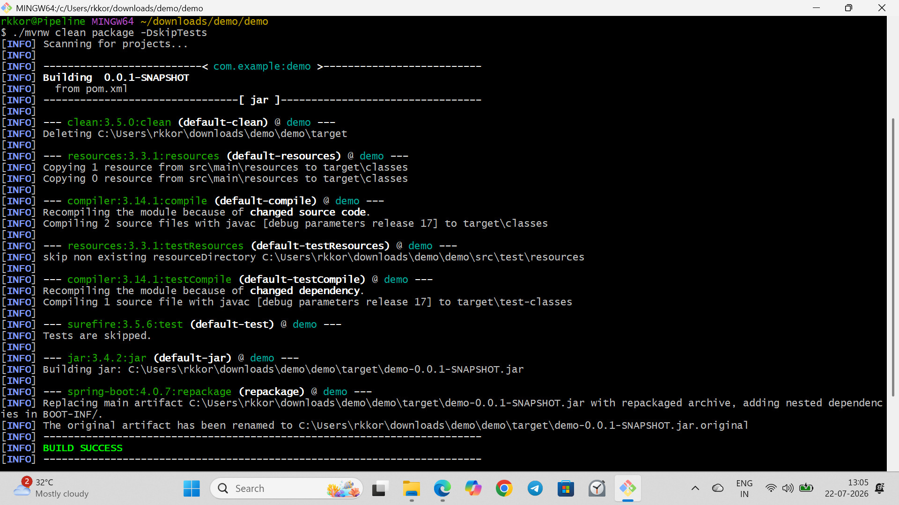
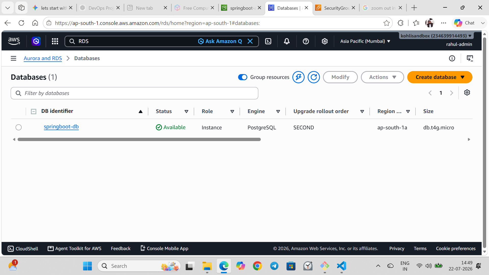
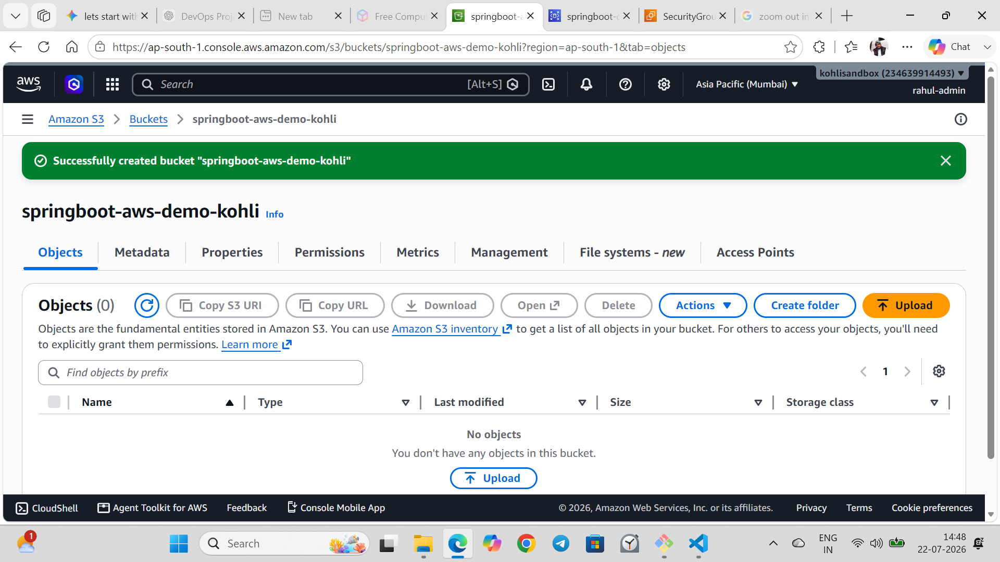
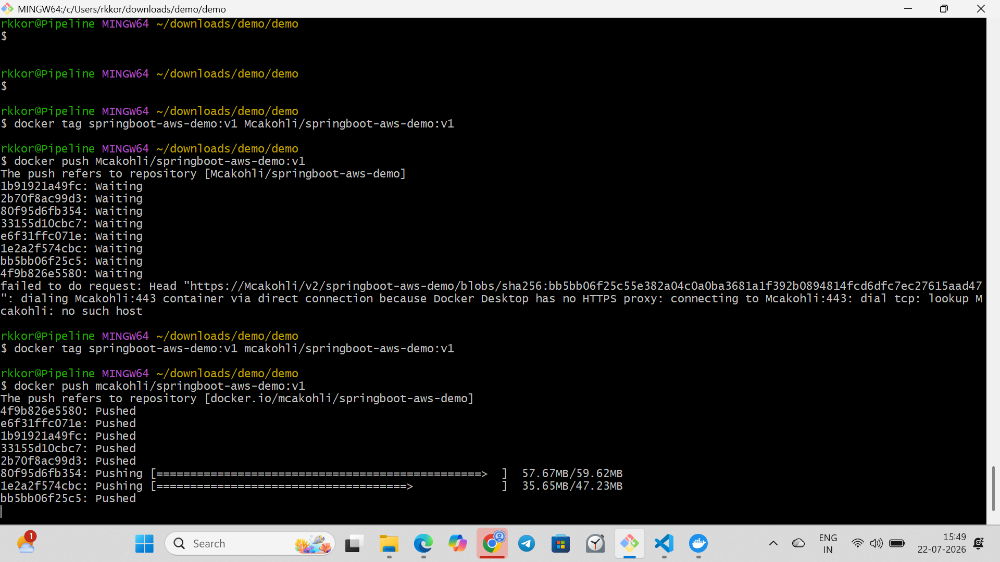
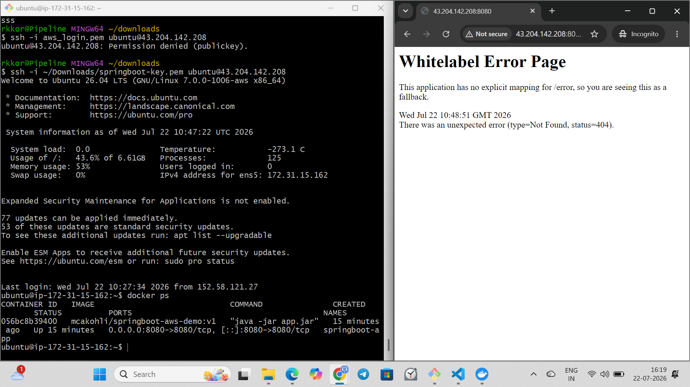

# 🚀 Spring Boot AWS & Docker Deployment Pipeline

A production-ready Spring Boot microservice integrated with cloud-native AWS services (RDS PostgreSQL and S3 Storage), containerized with Docker, and deployed on an AWS EC2 instance with an automated GitHub Actions CI/CD pipeline.

---

## 🏗️ Architecture & Tech Stack

```text
[ Client / Postman ] 
        │
        ▼
   [ AWS EC2 ] ──▶ [ Docker Container (Spring Boot REST API) ]
                               │                 │
                               ▼                 ▼
                       [ AWS RDS ]           [ AWS S3 ]
                     (PostgreSQL DB)      (File/Media Storage)
                                                              ```

                                                              
Backend: Java 17, Spring Boot 3, Spring Data JPA, RESTful API

Database: PostgreSQL on AWS RDS

Cloud Storage: Amazon S3 for file uploads

Containerization: Docker & Docker Hub

Cloud Infrastructure: AWS EC2 (Ubuntu Server)

CI/CD: GitHub Actions (Automated build, dockerize, and deploy workflow)

🛠️ Key Features
REST API Endpoints: Complete CRUD operations with Spring Boot.

Data Persistence: Relational data mapping using JPA Hibernate connected to AWS RDS PostgreSQL.

Object Storage: Media/file handling seamlessly linked to Amazon S3.

Containerization: Clean Dockerfile packaging the app into a reproducible lightweight container.

CI/CD Automation: Automated workflow triggering on every git push origin main to build the JAR, push to Docker Hub, and redeploy on AWS EC2.

## 🚀 Deployment Screenshots

### 1. Spring Boot Maven Build Success


### 2. AWS Cloud Infrastructure (RDS & S3)
| AWS RDS PostgreSQL | Amazon S3 Storage Bucket |
| :---: | :---: |
|  |  |

### 3. Docker Image Build & Push to Docker Hub


### 4. AWS EC2 Container Deployment & Live Application

Prerequisites
JDK 17+

Maven

Docker Desktop

1. Clone the Repository
Bash
git clone [https://github.com/mcakohli/springboot-aws-docker-demo.git](https://github.com/mcakohli/springboot-aws-docker-demo.git)
cd springboot-aws-docker-demo
2. Configure Environment Variables
Set up your database connection and AWS credentials in src/main/resources/application.yml or via environment variables:

YAML
spring:
  datasource:
    url: jdbc:postgresql://[your-rds-endpoint.amazonaws.com:5432/postgres](https://your-rds-endpoint.amazonaws.com:5432/postgres)
    username: your_db_username
    password: your_db_password

aws:
  s3:
    bucket: your-s3-bucket-name
3. Build & Run via Docker
Bash
# Build Docker image
docker build -t springboot-aws-demo .

# Run Container
docker run -p 8080:8080 --name springboot-app springboot-aws-demo
Access the API locally at: http://localhost:8080

👨‍💻 Author
Rahul Kohli — GitHub Profile
